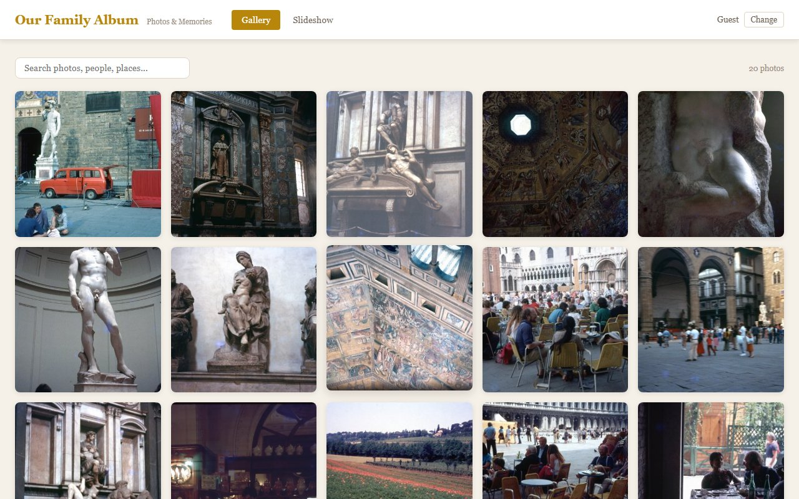
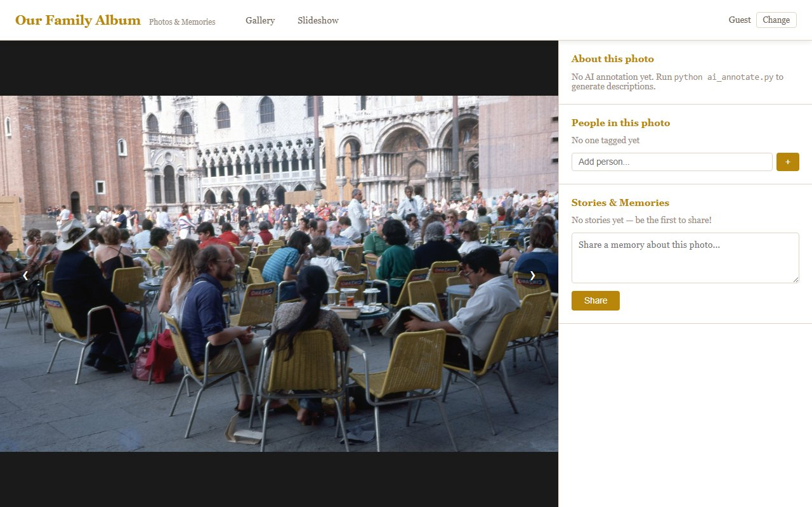

# Family Photo Viewer & Annotator

A web application for browsing, annotating, and sharing stories about family photos. Features AI-powered photo descriptions using Claude's vision API, collaborative people tagging, and a full-screen slideshow mode.


*Gallery view with search and people filter chips*


*Detail view with annotation sidebar, people tagging, and stories*

## Live Site

- **App**: https://family-album-a2m.pages.dev/
- **API**: https://family-album-api.sameersegal.workers.dev

## Architecture

```
Cloudflare Pages (static HTML/JS/CSS)
        │
        ├──→ Cloudflare R2 (images + thumbnails + manifest.json)
        │
        └──→ Cloudflare Worker API → D1 SQLite (annotations, people, anecdotes)
```

All three services are on Cloudflare's edge network. The frontend is a pure static SPA with no build step. Images are served from R2 with CORS configured for the Pages domain. The Worker API provides shared annotation storage via D1.

## Features

- **Gallery View** -- Browse photos in a responsive grid with full-text search and people filter chips
- **Detail View** -- View a photo with its AI-generated description, tag people, and add stories/memories
- **Slideshow** -- Full-screen auto-advancing slideshow with fade transitions and annotation overlays
- **AI Annotations** -- Two-pass pipeline: individual photo descriptions, then event/trip clustering
- **Collaborative** -- Multiple family members can tag people, correct AI descriptions, and share anecdotes
- **Flexible Storage** -- Works with local files or Cloudflare R2; Worker API or localStorage for data

## Project Structure

```
.
├── index.html                  # App entry point (SPA)
├── js/                         # Frontend JavaScript (ES modules)
│   ├── app.js                  # Main SPA logic (routing, views, events)
│   ├── store.js                # Data persistence (Worker API / localStorage)
│   └── config.js               # App configuration
├── css/
│   └── styles.css              # Styling (warm beige/gold theme)
├── assets/
│   └── frame.png               # Slideshow frame overlay
├── worker/                     # Cloudflare Worker + D1 backend
│   ├── src/index.js            # REST API endpoints
│   ├── schema.sql              # D1 database schema
│   ├── wrangler.toml           # Worker deployment config
│   └── package.json            # Worker dependencies
├── scripts/                    # Python utility scripts
│   ├── serve.py                # Local dev server (port 8765)
│   ├── build.py                # Generate manifest.json (+ optional thumbnails)
│   ├── ai_annotate.py          # AI photo annotation via Claude vision API
│   ├── download_images.py      # Download photos from Google Drive
│   └── upload_to_r2.py         # Upload photos & thumbnails to Cloudflare R2
├── .github/workflows/
│   └── deploy.yml              # CI/CD: deploys Pages + Worker on push to main
├── family_context_template.md  # Template for family background info
└── .gitignore
```

## Quick Start (Local Development)

### 1. Get your photos

Place your photos in an `images/` directory at the project root, or download them from Google Drive:

```bash
pip install -r requirements.txt
python scripts/download_images.py <GOOGLE_DRIVE_FOLDER_ID>
```

### 2. Build the manifest

```bash
python scripts/build.py
# Or with local thumbnails for faster gallery loading:
python scripts/build.py --thumbs
```

### 3. Start the dev server

```bash
python scripts/serve.py
# Open http://localhost:8765
```

For local dev, set `imageSource: 'local'` in `js/config.js`. The app will use `./images/` and localStorage.

### 4. (Optional) Generate AI annotations

Requires an [Anthropic API key](https://console.anthropic.com/settings/keys):

```bash
export ANTHROPIC_API_KEY="sk-ant-..."

# Pass 1: Annotate each photo individually
python scripts/ai_annotate.py

# Pass 2: Cluster photos by event/trip
python scripts/ai_annotate.py --cluster
```

For better results, copy `family_context_template.md` to `family_context.md` and fill in details about your family members, known trips, and cultural context.

## Deployment

### Current Production Setup

| Component | Service | URL |
|---|---|---|
| Static frontend | Cloudflare Pages | `https://family-album-a2m.pages.dev/` |
| Images & thumbnails | Cloudflare R2 | `https://pub-68327dca334d42bf90cf87e6f62b96fe.r2.dev` |
| API + database | Cloudflare Worker + D1 | `https://family-album-api.sameersegal.workers.dev` |

### CI/CD

Push to `main` triggers `.github/workflows/deploy.yml` which:
1. Deploys the static site to Cloudflare Pages
2. Deploys the Worker API to Cloudflare Workers

**Required GitHub secrets:**
- `CLOUDFLARE_API_TOKEN` — API token with Pages, Workers Scripts, and D1 permissions
- `CLOUDFLARE_ACCOUNT_ID` — Cloudflare account ID

### Uploading Images to R2

Images are too large for git and are stored in R2. Upload via the Python script:

```bash
# Set credentials in .env or environment
export R2_ACCOUNT_ID="your-account-id"
export R2_ACCESS_KEY_ID="your-access-key-id"
export R2_SECRET_ACCESS_KEY="your-secret-access-key"
export R2_BUCKET_NAME="family-photos"
export R2_PUBLIC_URL="https://pub-68327dca334d42bf90cf87e6f62b96fe.r2.dev"

python scripts/upload_to_r2.py              # upload all images
python scripts/upload_to_r2.py --limit 20   # upload first 20 only
python scripts/upload_to_r2.py --dry-run    # preview what would upload
```

This generates thumbnails, uploads originals + thumbnails to R2, and pushes `manifest.json` to R2.

### R2 CORS Configuration

The R2 bucket needs CORS rules to allow the Pages domain to fetch `manifest.json`:

```json
[
  {
    "AllowedOrigins": [
      "http://localhost:3000",
      "https://family-album-a2m.pages.dev"
    ],
    "AllowedMethods": ["GET", "HEAD"],
    "AllowedHeaders": ["*"],
    "MaxAgeSeconds": 86400
  }
]
```

Set this in **Cloudflare Dashboard > R2 > family-photos > Settings > CORS Policy**.

### Authentication (Cloudflare Access + Email OTP)

The app is gated by Cloudflare Access at the edge. Every visitor must
sign in with a 6-digit code sent to their email before the Pages site
or the Worker API will serve anything. **The Access application's
policy is the single source of truth for who's allowed in** — manage
the family list in the Zero Trust dashboard.

On first login, the user is prompted for a display name (used for
attribution on stories and tags). Names are stored in a `users` table
in D1 along with a `role` column (`admin` or `member`). Everyone
defaults to `member`; promote to `admin` manually when needed (admins
can delete anyone's anecdote, not just their own).

**One-time setup in the Zero Trust dashboard:**

1. Go to **Zero Trust > Settings > Authentication** and enable the
   **One-time PIN** login method. No extra config needed.
2. Go to **Access > Applications > Add an application > Self-hosted**
   and create one application covering both domains so they share a
   session:
   - Application domains: `family-album-a2m.pages.dev` and
     `family-album-api.sameersegal.workers.dev`
   - Session duration: **1 month** (seniors shouldn't re-auth weekly)
   - Identity providers: One-time PIN only
   - Auto-redirect to identity: on
   - CORS preflight bypass: on (required for cross-origin API calls)
3. Add an Allow policy with **Include → Emails**, listing every family
   member. This is the only gate — emails not listed here simply cannot
   log in.
4. Copy the **AUD Tag** and team domain from the Overview tab and store
   them as Wrangler secrets (repo is public, so these don't live in
   `wrangler.toml`):
   ```bash
   cd worker
   npx wrangler secret put ACCESS_TEAM_DOMAIN   # paste team domain
   npx wrangler secret put ACCESS_AUD           # paste AUD Tag
   ```

**Promoting someone to admin:**

```bash
# First have them log in at least once — that creates their users row.
npx wrangler d1 execute family-album --remote --command \
  "UPDATE users SET role='admin' WHERE email='you@example.com';"

# See who's logged in and what role they have
npx wrangler d1 execute family-album --remote --command \
  "SELECT email, name, role, created_at FROM users ORDER BY created_at;"
```

**Adding or removing family members:** edit the Access application's
policy in the Zero Trust dashboard. Removal there revokes their ability
to log in immediately; their existing `users` row is harmless and can
be left in place.

### Deploying the Worker Manually

```bash
cd worker
npm install
npx wrangler d1 execute family-album --remote --file=schema.sql   # first time only
npx wrangler deploy
```

## Configuration

Edit `js/config.js`:

| Setting | Description |
|---|---|
| `imageSource` | `'local'` for `./images/` or `'r2'` for Cloudflare R2 |
| `r2.publicUrl` | R2 public bucket URL |
| `api.workerUrl` | Worker API URL (leave empty for localStorage-only mode) |
| `slideshow.autoAdvanceMs` | Slideshow auto-advance interval (default: 6000ms) |

### Worker API Endpoints

| Method | Path | Description |
|---|---|---|
| `GET` | `/api/photos` | List all photo annotations |
| `GET` | `/api/photos/:id` | Get single photo annotation |
| `PATCH` | `/api/photos/:id` | Update annotation |
| `POST` | `/api/photos/:id/confirm` | Confirm AI annotation |
| `POST` | `/api/photos/:id/corrections` | Save user corrections |
| `POST` | `/api/photos/:id/anecdotes` | Add a story |
| `DELETE` | `/api/photos/:id/anecdotes/:idx` | Remove a story |
| `POST` | `/api/photos/:id/people` | Tag a person |
| `DELETE` | `/api/photos/:id/people/:name` | Untag a person |
| `GET` | `/api/people` | List all known people |
| `POST` | `/api/import` | Bulk import AI annotations |

### D1 Database Schema

Three tables: `photos` (annotations), `photo_people` (many-to-many tags), `people` (directory). See `worker/schema.sql`.

## Keyboard Shortcuts

### Slideshow
| Key | Action |
|---|---|
| Right Arrow / Space | Next photo |
| Left Arrow | Previous photo |
| P | Pause / resume |
| Escape | Exit slideshow |

### Detail View
| Key | Action |
|---|---|
| Right Arrow | Next photo |
| Left Arrow | Previous photo |
| Escape | Back to gallery |

## Todo

- [ ] Run AI annotations on the 20 uploaded images (`python scripts/ai_annotate.py --limit 20`) and import to D1 via `POST /api/import`
- [ ] Upload remaining images beyond the initial 20 (`python scripts/upload_to_r2.py`)
- [ ] Add a custom domain to Cloudflare Pages and update R2 CORS allowed origins
- [ ] Update GitHub Actions to Node.js 24 compatible action versions before June 2026
- [ ] Add family_context.md for richer AI annotation context

## Tech Stack

- **Frontend**: Vanilla JavaScript (ES modules), HTML5, CSS3 -- no build step required
- **Backend**: Cloudflare Worker + D1 (SQLite)
- **Images**: Cloudflare R2 (with local fallback)
- **AI**: Claude Sonnet (via Anthropic API) for photo descriptions and clustering
- **CI/CD**: GitHub Actions with `cloudflare/wrangler-action`
- **Scripts**: Python 3 for image processing, uploads, and AI annotation

## Requirements

- A modern web browser (ES module support)
- Python 3.10+ (for the utility scripts)
- Node.js 20+ (for Cloudflare Worker development)
- See `requirements.txt` for Python package dependencies
